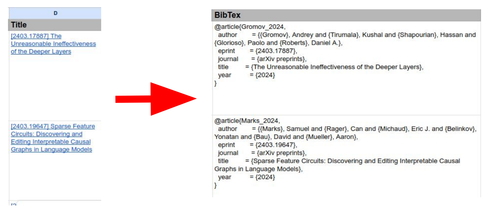

# Spreadsheet2bibtex
Simple python tool too manage a bibliography using Google Spreadsheets. You can retrieve bibtex from the title of the paper and add the bibtex to another column. You then can exporte the bibtex column in .bib file
  <p align="center">
    
</p>


## Setup
### 1. Enable Google Sheets API
- Create a project in the [Google Developers Console](https://console.cloud.google.com/projectcreate)
- [Enable the Google Sheets API](https://console.cloud.google.com/flows/enableapi?apiid=sheets.googleapis.com) in the project 
- [configure OAuth consent screen](https://console.cloud.google.com/flows/enableapi?apiid=sheets.googleapis.com)
- [Authorize credentials for a desktop application](https://developers.google.com/sheets/api/quickstart/python#authorize_credentials_for_a_desktop_application)
- Put the downloaded `credentials.json` in `credentials/credentials.json`
- create a .env file with the following env variable:
```bash
SPREADSHEET_ID="" # retrieve from the url
INPUT_RANGE="Main!D2:D100"  # cell with the title of the form [1234.56789] Your amazing ArxIv paper
OUTPUT_RANGE="Main!K2:K100" # cell where you want the bibtex
```

## Installation
Install dependencies:
```bash
pip install -r requirements
```

The backend of this project is the [doi2bibtex](https://github.com/timothygebhard/doi2bibtex/tree/main) package. Check it out for the configuration of the bibtex entries. 

## Usage
To add to the spreadsheet the bibtex at column `OUTPUT_RANGE` just do:
```bash
python spreadsheets2bibtex.py
```

If you want to output the content of colum `OUTPUT_RANGE` to a `output.bib`:
```bash
python spreadsheets2bibtex.py --bib
```


## TODO

- [] Automatically substitute the Venue citations to the ArXiv one if exists
